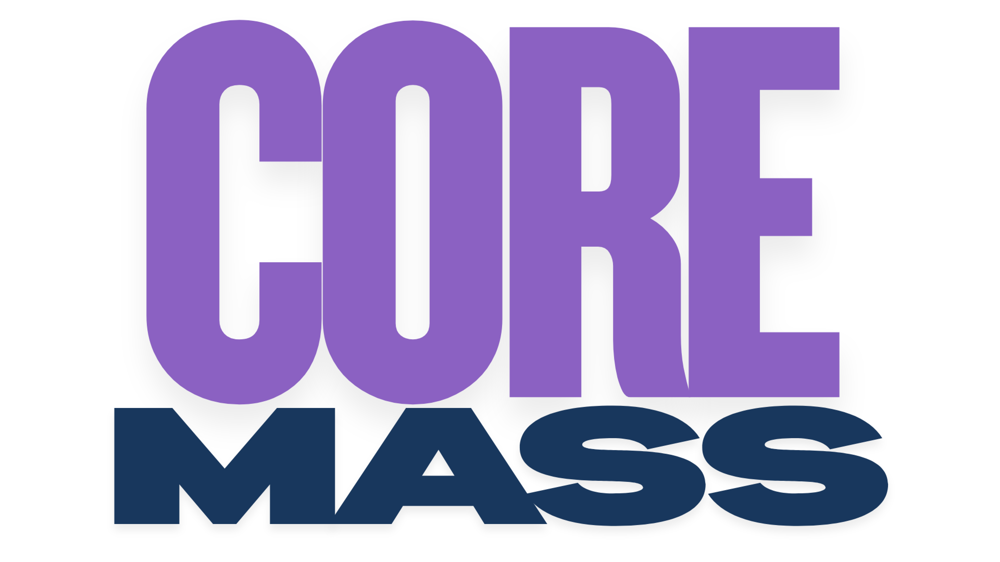

# Hacktoberfest 2025 – Frontend


[](https://github.com/JHAJI01/hacktoberfest-2025-frontend/commits/main)
[](https://github.com/JHAJI01/hacktoberfest-2025-frontend/blob/main/LICENSE)
[](https://github.com/JHAJI01/hacktoberfest-2025-frontend/actions/workflows/ci.yml)
[](https://securityscorecards.dev/viewer/?uri=github.com/JHAJI01/hacktoberfest-2025-frontend)
[](https://github.com/JHAJI01/hacktoberfest-2025-frontend/issues)
[](https://github.com/JHAJI01/hacktoberfest-2025-frontend/pulls)
[](https://github.com/JHAJI01/hacktoberfest-2025-frontend/graphs/contributors)
[](https://github.com/JHAJI01/hacktoberfest-2025-frontend/stargazers)
[](https://github.com/JHAJI01/hacktoberfest-2025-frontend/network/members)
[](#contributors)

---

## Welcome Hacktoberfest Contributors!

This repo is part of [Open Code Chicago](https://opencodechicago.org)’s Hacktoberfest 2025 initiative.  
Whether it’s your **first pull request** or your **50th**, you are welcome here!

Contribute to real-world open source code, learn frontend development, and collaborate with a global community.

### ⭐ Support the Project!
If you like this project, please consider giving it a ⭐ on GitHub!
More stars help us reach a wider audience, attract new contributors, and make your contributions even more visible and valuable for your portfolio or employer.
Thank you for helping our open source community grow!


---

## Project Preview

Here’s a sneak peek of the **frontend design (hero section)**:


---

## Screenshots

Explore more visuals of the application:

- **Hacktoberfest Banner**:  
  

- **Product Collection Example**:  
  

- **Brand Logos**:  
    

---

## Design

You can explore our creative Figma design and UI references here:  
[Open in Figma](https://www.figma.com/design/XeX3NqT6LPTWrCuj8syMMK/CoreX?node-id=0-1&t=oHdbozLQfS2cLefT-1)

---

## Table of Contents
- [Design](#design)
- [Description](#description)
- [Who is this for?](#who-is-this-for)
- [Tech Stack](#tech-stack)
- [Quick Start](#quick-start)
- [Backend API Access](#backend-api-access)
- [Features](#features)
- [Project Structure](#project-structure)
- [Contributing](#contributing)
- [Hacktoberfest Contribution Guide](#hacktoberfest-contribution-guide)
- [Documentation](#documentation)
- [Contributors](#contributors)
- [Security](#security)
- [License](#license)
- [Feedback](#feedback)
- [Support](#support)
- [Connect with us](#connect-with-us)

---

## Description

This is the **frontend project** for [Open Code Chicago](https://opencodechicago.org)’s Hacktoberfest 2025 initiative.  
It’s built with **React, Vite, and TailwindCSS**, and designed for **community collaboration**.  
Contributors of all levels are welcome to help improve UI, components, and user experience.

---

## Who is this for?

- Beginners looking to make their **first open source contribution**  
- Intermediate developers who want to learn **React, Vite, and frontend best practices**  
- Experienced contributors mentoring and guiding others  

---

## Tech Stack

- **React + Vite** (fast dev server & build)
- **Tailwind CSS** (utility-first styling)
- **ESLint + Prettier** (code style and linting)
- **GitHub Actions** (CI/CD with linting & builds)

---

## Quick Start

See the [Usage Guide](docs/usage.md) for detailed setup.

### Prerequisites
- **Node.js** (version 18 or higher) – [Download here](https://nodejs.org/)
- **npm** (comes with Node.js) or **yarn**
- A code editor like VS Code

### Installation Steps

1. **Clone the repository**:
   ```bash
   git clone https://github.com/OpenCodeChicago/hacktoberfest-2025-frontend.git
   cd hacktoberfest-2025-frontend
   ```

2. **Set up environment variables**:
   Copy `.env.example` to `.env`:
   ```bash
   cp .env.example .env
   ```
   Edit `.env` to add your API keys or configurations if needed. The backend API URL is already configured.

3. **Install dependencies**:
   ```bash
   npm install
   ```

4. **Start the development server**:
   ```bash
   npm run dev
   ```
   The app will be available at `http://localhost:5173` (default Vite port).

### Connecting to the Backend
The app is configured to connect to the live backend API at `https://corexshoptest.onrender.com`. No additional setup is required for basic functionality. See the [Backend API Access](#backend-api-access) section for more details.

---

## Troubleshooting

### Common Issues

- **Port 5173 already in use**: If you see an error that the port is busy, try changing the port:
  ```bash
  npm run dev -- --port 3000
  ```

- **Build errors**: Ensure you have the correct Node.js version (18+). Clear node_modules and reinstall:
  ```bash
  rm -rf node_modules package-lock.json
  npm install
  ```

- **API connection issues**: Check your internet connection and ensure the backend API is up. You can test the API directly at `https://corexshoptest.onrender.com/api/products`.

- **ESLint errors**: Run the linter to check for issues:
  ```bash
  npm run lint
  ```

If you encounter other issues, check the [FAQ](docs/faq.md) or open an issue on GitHub.

---

## Backend API Access

Our backend is now live!
Contributors can connect to the deployed API to retrieve product data for their tasks.

**Base URL:**  
`https://corexshoptest.onrender.com`

**API URL is available as the environment variable `VITE_API_URL`.**

### Available Endpoints

- `GET /api/products`  
  Retrieve all products (supports pagination and filtering).

- `GET /api/products/:id`  
  Retrieve a single product by its ID.

- `GET /api/products?category=Protein`  
  Filter products by category.

- `GET /api/products?goals=Weight Loss`  
  Filter products by goal.

- `GET /api/products?minPrice=20&maxPrice=50`  
  Filter products by price range.

- `GET /api/products?search=whey`  
  Search products by keyword.

- `GET /api/products?category=Protein&goals=Muscle Growth&minPrice=30`  
  Combine multiple filters.

- `GET /api/products?page=1&limit=10`  
  Pagination support.

**Example usage:**
```http
GET https://corexshoptest.onrender.com/api/products?category=Protein&minPrice=20&maxPrice=50&page=1&limit=10
```

**Feel free to use these endpoints in your components and features! If you have questions about the API, open an issue or ask in our Discord.**

---

## Features

- **Product Browsing & Filtering**: Explore a wide range of products with advanced filtering options by category, goals, price, and search keywords.
- **Shopping Cart Management**: Add, remove, and manage items in your cart with real-time updates.
- **User Reviews & Ratings**: View and contribute to product reviews to help others make informed decisions.
- **Responsive Design**: Optimized for mobile, tablet, and desktop devices using Tailwind CSS.
- **SEO Optimization**: Built-in SEO components for better search engine visibility.
- **Accessibility Features**: Designed with accessibility in mind, including proper ARIA labels and keyboard navigation.
- **Multi-Page Navigation**: Seamless navigation between Home, About, Products, Privacy Policy, Return Policy, Shipping Policy, and Accessibility pages.
- Developer-friendly setup with **React + Vite**
- Utility-first styling with **Tailwind CSS**
- Preconfigured **linting & formatting** (ESLint + Prettier)
- Automated checks via **GitHub Actions CI**
- Community-driven with **issues & PR templates**

---

## Project Structure

```bash
hacktoberfest-2025-frontend/                     # Main project root
├── .github/                                     # GitHub configuration
│   ├── ISSUE_TEMPLATE/                          # Predefined issue templates
│   │   ├── bug_report.md
│   │   └── feature_request.md
│   ├── workflow/                                # GitHub Actions workflows
│   │   └── ci.yml
│   ├── CODEOWNERS                               # Defines code reviewers
│   ├── dependabot.yml                           # Automated dependency updates
│   └── PULL_REQUEST_TEMPLATE.md                 # Standard PR template
│
├── docs/                                        # Project documentation
│   ├── images/                                  # Images and assets for docs
│   ├── faq.md
│   └── usage.md
│
├── src/                                         # Application source code
│   ├── components/                              # React components
│   └── main.js                                  # Entry point
│
├── .all-contributorsrc                          # Config for all-contributors bot
├── .gitignore                                   # Ignored files
├── .prettierrc                                  # Code formatting config
├── CODE_OF_CONDUCT.md                           # Community standards
├── CONTRIBUTING.md                              # Contribution guidelines
├── LICENSE                                      # License file
├── README.md                                    # Project overview
├── SECURITY.md                                  # Security policy
└── index.html                                   # Main HTML file
```

---

## Contributing

We welcome contributions from everyone!
Please see our [Contributing Guidelines](CONTRIBUTING.md) for details on how to get started.

💡 **Tip:** Before working on UI-related issues, please refer to the [Design section](#design) for Figma files and UI guidelines.

---

## Hacktoberfest Contribution Guide

1. Fork this repository
2. Check our [Project Board](https://github.com/orgs/OpenCodeChicago/projects/2)  
   - Look for an issue you’d like to work on  
   - Comment on the issue to let others know you’re taking it  
   - Maintainers may assign you to it (to avoid duplicates)
3. Create a new branch:
   ```bash
   git checkout -b my-new-feature
   ```
4. Make your changes (small, clear commits)
5. Run `npm run lint` before pushing
6. Push your branch and open a Pull Request
   - All PRs are automatically checked for linting in CI
   - Tip: Start with [Good First Issues](https://github.com/OpenCodeChicago/hacktoberfest-2025-frontend/labels/good%20first%20issue)

---

## Documentation

- [Usage Guide](docs/usage.md)  
- [FAQ](docs/faq.md)  
- [Contributing Guidelines](CONTRIBUTING.md)  
- [Pull Request Template](.github/PULL_REQUEST_TEMPLATE.md)  
- [Code Owners](.github/CODEOWNERS)  
- [Issue Templates](.github/ISSUE_TEMPLATE/)  

---

## Contributors

Thanks goes to these wonderful people:

<!-- ALL-CONTRIBUTORS-LIST:START - Do not remove or modify this section -->
<!-- prettier-ignore-start -->
<!-- markdownlint-disable -->
<table>
  <tbody>
    <tr>
      <td align="center" valign="top" width="14.28%"><a href="https://alexsmagin.dev"><br /><sub><b>Alex Smagin</b></sub></a><br /><a href="https://github.com/OpenCodeChicago/hacktoberfest-2025-frontend/commits?author=Alexandrbig1" title="Documentation">📖</a> <a href="#infra-Alexandrbig1" title="Infrastructure (Hosting, Build-Tools, etc)">🚇</a> <a href="#maintenance-Alexandrbig1" title="Maintenance">🚧</a> <a href="#projectManagement-Alexandrbig1" title="Project Management">📆</a></td>
      <td align="center" valign="top" width="14.28%"><a href="https://github.com/amilliiee"><br /><sub><b>amilliiee</b></sub></a><br /><a href="https://github.com/OpenCodeChicago/hacktoberfest-2025-frontend/commits?author=amilliiee" title="Code">💻</a></td>
      <td align="center" valign="top" width="14.28%"><a href="https://sohamroy.netlify.app"><br /><sub><b>SOHAM</b></sub></a><br /><a href="https://github.com/OpenCodeChicago/hacktoberfest-2025-frontend/commits?author=Soham-0047" title="Code">💻</a></td>
      <td align="center" valign="top" width="14.28%"><a href="https://github.com/Ankit-Kum-ar"><br /><sub><b>Ankit Kumar</b></sub></a><br /><a href="https://github.com/OpenCodeChicago/hacktoberfest-2025-frontend/commits?author=Ankit-Kum-ar" title="Code">💻</a></td>
      <td align="center" valign="top" width="14.28%"><a href="https://github.com/a-woodworth"><br /><sub><b>a-woodworth</b></sub></a><br /><a href="https://github.com/OpenCodeChicago/hacktoberfest-2025-frontend/commits?author=a-woodworth" title="Code">💻</a></td>
      <td align="center" valign="top" width="14.28%"><a href="https://github.com/mensonones"><br /><sub><b>Emerson Vieira</b></sub></a><br /><a href="https://github.com/OpenCodeChicago/hacktoberfest-2025-frontend/commits?author=mensonones" title="Code">💻</a></td>
      <td align="center" valign="top" width="14.28%"><a href="https://github.com/AparAgarwal"><br /><sub><b>Apar Agarwal</b></sub></a><br /><a href="https://github.com/OpenCodeChicago/hacktoberfest-2025-frontend/commits?author=AparAgarwal" title="Code">💻</a></td>
    </tr>
    <tr>
      <td align="center" valign="top" width="14.28%"><a href="https://github.com/mitaliiiiii"><br /><sub><b>mitaliiiiii</b></sub></a><br /><a href="https://github.com/OpenCodeChicago/hacktoberfest-2025-frontend/commits?author=mitaliiiiii" title="Code">💻</a></td>
      <td align="center" valign="top" width="14.28%"><a href="https://www.anasfarooq.com/"><br /><sub><b>Muhammad Anas Farooq</b></sub></a><br /><a href="https://github.com/OpenCodeChicago/hacktoberfest-2025-frontend/commits?author=anasfarock" title="Code">💻</a> <a href="https://github.com/OpenCodeChicago/hacktoberfest-2025-frontend/commits?author=anasfarock" title="Tests">⚠️</a></td>
    </tr>
  </tbody>
</table>

<!-- markdownlint-restore -->
<!-- prettier-ignore-end -->

<!-- ALL-CONTRIBUTORS-LIST:END -->

This project follows the [all-contributors](https://allcontributors.org) specification.  

> Want to be listed here? [See how to add yourself!](./CONTRIBUTING.md#get-recognized-with-the-all-contributors-bot)

Contributions of any kind welcome!

---

## Security

This repository has the following security features enabled:

- **Dependency Review Action** – warns/block PRs introducing vulnerable or malicious packages  
- **OpenSSF Scorecard** – weekly scans for open-source best practices and supply-chain risks  
- **Dependabot** – automated dependency updates  

For details, see our [Security Policy](SECURITY.md).

---

## License

This project is licensed under the [MIT License](LICENSE).

---

## Feedback

We welcome feedback and suggestions to improve the template’s functionality and usability.  
Feel free to [open an issue](https://github.com/OpenCodeChicago/hacktoberfest-2025-frontend/issues) or [start a discussion](https://github.com/OpenCodeChicago/hacktoberfest-2025-frontend/discussions).  

---

## Support

📧 Contact: [info@opencodechicago.org](mailto:info@opencodechicago.org)

---

## Languages and Tools

---

## Connect with us

<div align="center">
<a href="https://www.youtube.com/@AlexSmaginDev" target="_blank">

</a>
<a href="https://discord.gg/t6MGsCqdFX" target="_blank">
    
</a>
<a href="https://www.linkedin.com/company/open-code-chicago" target="_blank">

</a>
<a href="https://www.facebook.com/profile.php?id=61580367112591" target="_blank">

</a>

</div>
